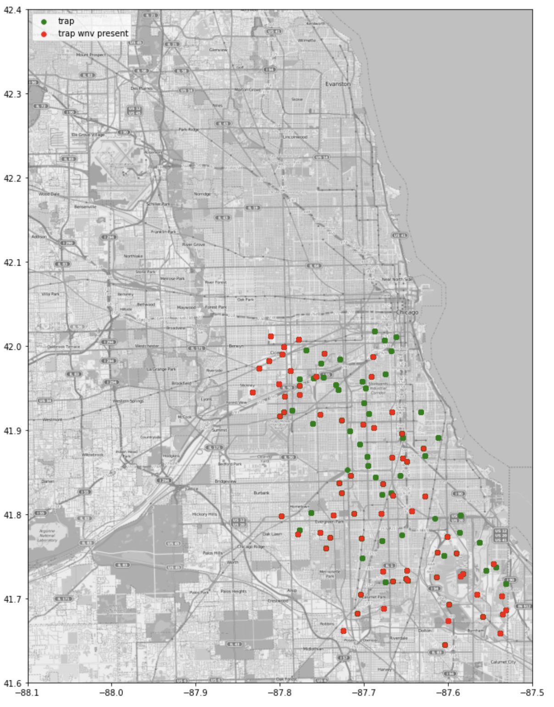
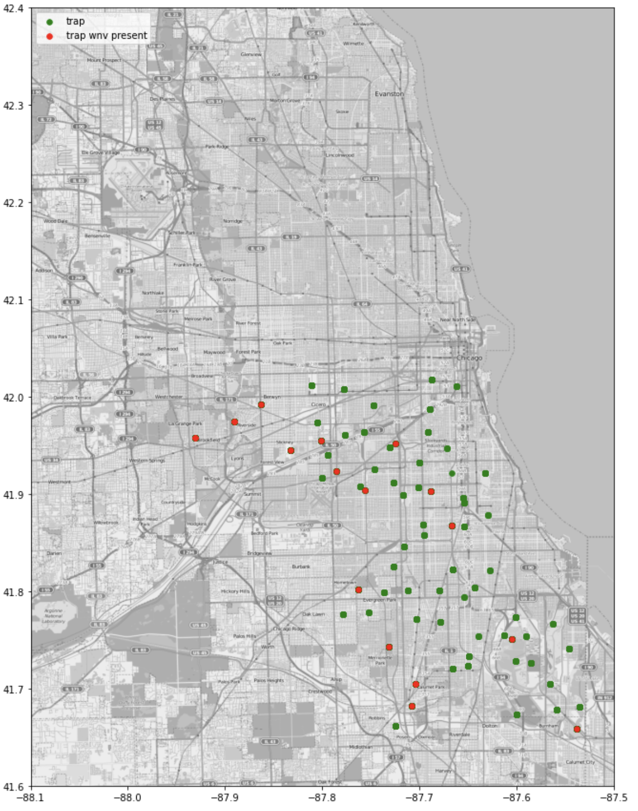
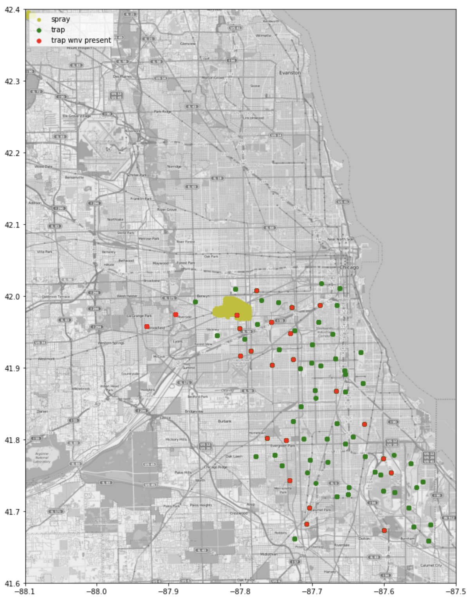
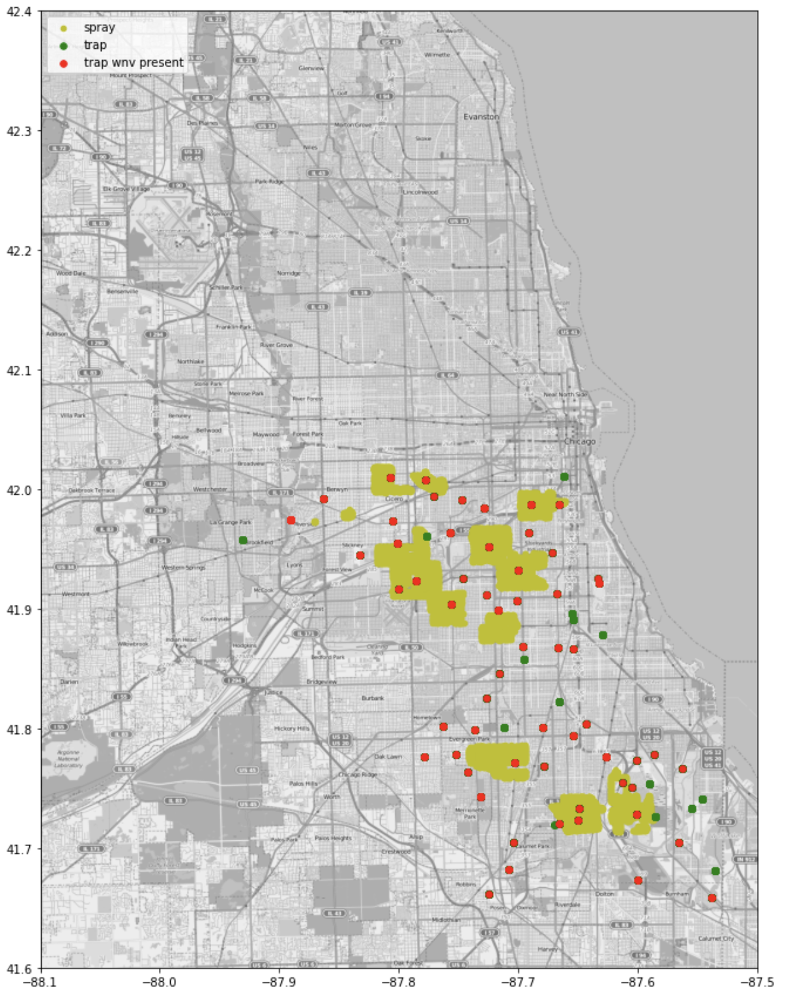
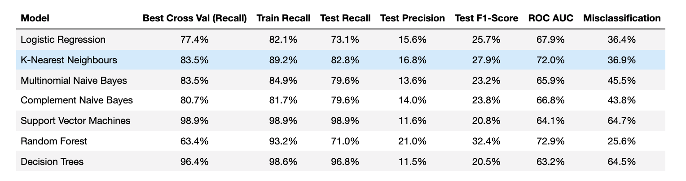

# West Nile Virus Prediction in Cook County, Illinois
---

### Background & Problem Statement

West Nile Virus (WNV) was first seen in the United States in 1999. Since then,
it has quickly spread across the Country.

Mosquitos are infected by feeding on dead birds which are already host to the virus,
and in turn spread WNV to humans and other animals by biting them.

Cases of WNV primarily occur during mosquito season; from the summer through fall (May to October)

As a member of the Disease and Treatment Agency, in the Creative Engineering division,
we have been hired by the Department of Public Health in Cook county Illinois to derive an effective plan to deploy pesticides in the city of Chicago to both, cut costs and minimize the presence of mosquitos with WNV.
 
 

## Data Dictionary
The dataset use for this project originate from this [source](https://www.kaggle.com/c/predict-west-nile-virus)

Below are the extra columns that we had derived to improvise the model
|Column Name| Type | Description|
|---|---|---|
|long_lat| float64| feature engineer of longitude and langitude|
|rel_humidity| float64| calculate of relative humidty|
|station| float64 | the nearest station based on the longitude and langitude provided|

### Summary of Findings and Modelling
___
|2007|2009|2011|2013|
|---|---|---|---|
|||||

(Mosquito Spraying and West Nile Virus presence in Cook county in the years 2007,2009,2011 and 2013.)

Through plotting the weather data provided we were able to tell at a glance that there was some correlation between number of mosquitos observed and factors such as, precipitation, temperature and humidity.

This will be further confirmed into our exploration of coefficients when modelling.
Logistic Regression coefficient analysis revealed to our top features when predicting for WNV: 'week', 'wetbulb3', 'wetbulb', 'avgspeed3', 'rel_humidity2', 'preciptotal' and 'cool3'

 
 

After trying several models, we settled on K-Nearest Neighbours (KNN) as our best performing model based on recall and ROC_AUC. Due to the class imbalances, WNV absent being only ~6% of all data, we settled on recall being our key-metric as it reflects how well the model is able to predict the presence of WNV correctly.

||predicted WNV absent|predicted WNV present|
|---|---|---|
|**actual WNV absent**|605|382|
|**actual WNV present**|16|77|

(Confusion Matrix for K-Nearest Neighbours)
 
 

### Conclusion and Recommendations
___
Through our cost-benefit analysis we estimate that at least 18 cases of WNV would need to be prevented in order for the costs of spraying to be justified.

Our model will aid in cutting these costs so that more preventative measures to combat WNV will fit in a local government/district's budget where necessary such that more lives can be saved more effectively.

Through this study we feel that the costs saved could also be allocated to obtaining more predictive data, such as localized weather readings, or larger sampling sizes for mosquitos, to more accurately reported numbers of WNV in mosquitoes. This will then allow future iterations of the model to be better able to predict and save costs.

Lastly, we recommend to local governments and districts to relocate costs into campaigning for personal protective measures against WNV, informing the public of the benefits of applying repellent, wearing preventative attire as well as educating on disposing stagnant water in order to reduce the cases of WNV.
